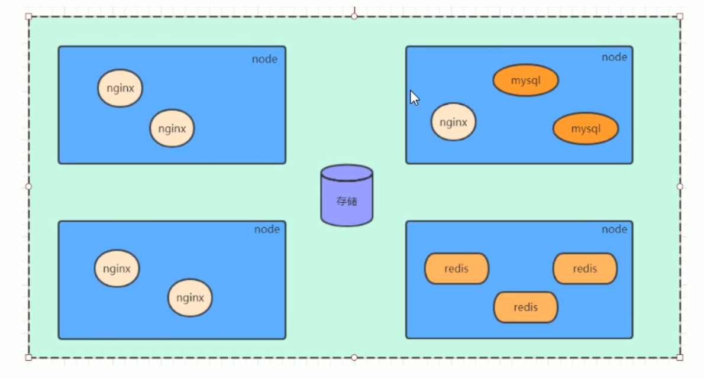

# Kubernetes

## Kubernetes简介

​		kubernetes，是一个全新的基于容器技术的分布式架构领先方案，是谷歌严格保密十几年的秘密武器---Borg系统的一个开源版本，于2014年9月发布第一个版本，2015年7月发布第一个正式版本

​		kubernetes的本质是一组**服务器集群**，它可以在集群的每个节点上运行特定的程序，来对节点中的容器进行管理。它的目的就是是实现资源管理的自动化，主要提供了如下的主要功能:

* **自我修复：**某容器一旦奔溃，能在秒级启动新的容器
* **弹性伸缩：**可以根据需要，自动对集群中正在运行的容器数量进行调整（自动扩缩容）
* **服务发现：**服务可以通过自动发现的形式找到它所依赖的服务

* **负载均衡：**如果一个服务启动了多个容器，能够自动实现请求的负载均衡
* **版本回退：**如果发现新发布的程序版本有问题，可以立即回退到原来版本
* **存储编排：**可以根据容器自身的需求自动创建存储卷

## Kubernetes组件

一个kubernetes集群主要是由**控制节点(master)**、**工作节点(node)**构成，每个节点上都会安装不同的组件。

**master：集群的控制平面，负责集群的决策**

> 
>
> **ApiServer：**资源操作的唯一入口，接收用户输入的命令，提供认证、授权、API注册和发现等机制
>
> **Scheduler：**负责集群资源调度，按照预定的调度策略将Pod调度到相应的node节点上
>
> **ControllerManager：**负责维护集群的状态，比如程序部署安排、故障检测、自动扩展、滚动更新等
>
> **Etcd：**负责存储集群中各种资源对象的信息
>
> 

**node：集群的数据平面，负责为容器提供运行环境**

>
>
>**Kubelet：**负责维护容器的生命周期，即通过控制docker，来创建、更新、销毁容器
>
>**KubeProxy：**负责提供集群内部的服务发现和负载均衡
>
>**Docker：**负责节点上容器的各种操作
>
>

  

## kubernetes概念

Master：集群控制节点，每个集群需要至少一个master节点负责集群的管控

Node：工作负载节点，由master分配容器到这些node工作节点上,然后node节点上的docker负责容器的运行

Pod：kubernetes的最小控制单元，容器都是运行再pod中的，一个pod有一个或者多个容器

Controller：控制器，通过它来实现对pod的管理，比如启动pod，停止pod，伸缩pod的数量等等

Service：pod对外服务的统一入口，下面可以维护着同一类的多个pod

Label：标签，用于对pod进行分类，同一类pod会拥有相同的标签

NameSpace：命名空间，用来隔离pod的运行环境

